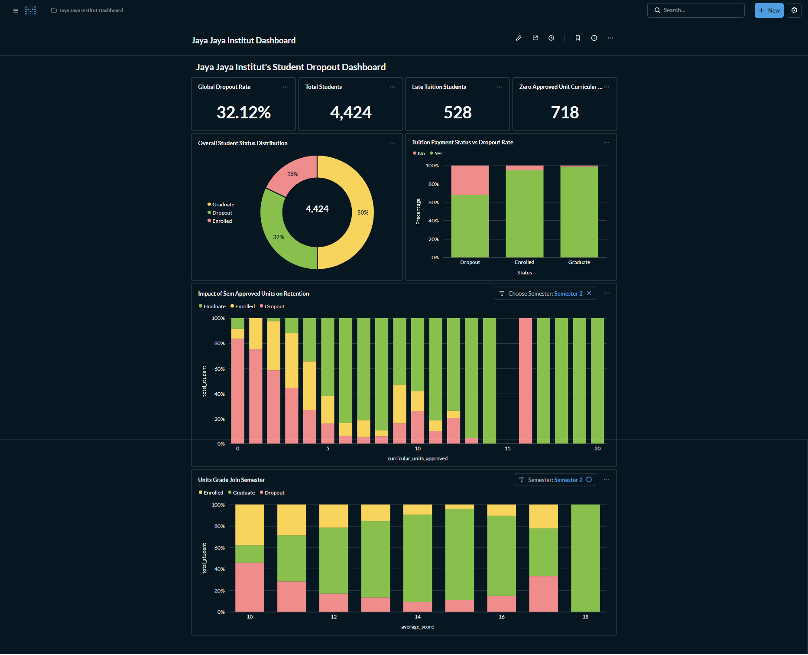

# Proyek Akhir: Menyelesaikan Permasalahan Perusahaan Edutech

## Business Understanding
Jaya Jaya Institut merupakan salah satu institusi pendidikan perguruan yang telah berdiri sejak tahun 2000. Hingga saat ini ia telah mencetak banyak lulusan dengan reputasi yang sangat baik. Akan tetapi, terdapat banyak juga siswa yang tidak menyelesaikan pendidikannya alias dropout.

### Permasalahan Bisnis
Jumlah dropout yang tinggi ini tentunya menjadi salah satu masalah yang besar untuk sebuah institusi pendidikan. Oleh karena itu, Jaya Jaya Institut ingin mendeteksi secepat mungkin siswa yang mungkin akan melakukan dropout sehingga dapat diberi bimbingan khusus.

## Cakupan Proyek

Proyek ini bertujuan untuk mengatasi tingginya angka putus kuliah (dropout) di Jaya Jaya Institut. Dengan memanfaatkan data historis mahasiswa, proyek ini membangun solusi *end-to-end* Data Science yang mencakup:

1.  **Analisis Data Eksploratif (EDA):** Mengidentifikasi pola utama penyebab dropout, mulai dari faktor akademik, finansial, hingga demografi.
2.  **Machine Learning Modeling:** Membangun model prediksi klasifikasi (menggunakan Random Forest/XGBoost) untuk mendeteksi mahasiswa berisiko tinggi ("High Risk") sedini mungkin.
3.  **Business Dashboard:** Visualisasi interaktif menggunakan Metabase untuk memantau KPI retensi secara *real-time*.
4.  **Aplikasi Web (Prototype):** Deployment model menggunakan Streamlit agar dapat digunakan langsung oleh staf akademik untuk memprediksi status mahasiswa.

## Persiapan

### Sumber Data
Link Dataset : https://github.com/dicodingacademy/dicoding_dataset/tree/main/students_performance 

### Setup Environment
 Clone repository ini dan jalankan perintah berikut:

```bash
# 1. Clone repository
git clone [https://github.com/abrarargya/student-dropout-analytics.git](https://github.com/abrarargya/student-dropout-analytics.git)

# 2. Masuk ke direktori
cd student-dropout-analytics

# 3. Install dependencies
pip install -r requirements.txt

```
### Menjalankan Business Dashboard

Untuk melihat visualisasi data dan dashboard interaktif, proyek ini menggunakan Metabase yang dijalankan di lingkungan lokal menggunakan Docker. File database yang berisi konfigurasi dashboard (metabase.db.mv.db) telah disertakan dalam submission ini.

Berikut langkah-langkah untuk menyiapkan lingkungan Metabase:

1. Pastikan Docker Aktif Pastikan Docker Desktop atau Docker Engine sudah terinstall dan berjalan di komputer Anda.

2. Pull Image Metabase Unduh image Metabase terbaru dari Docker Hub dengan menjalankan perintah berikut di terminal:

```Bash
docker pull metabase/metabase:latest
```
Jalankan Container Jalankan container Metabase di port 3000:
```Bash
docker run -d -p 3000:3000 --name metabase metabase/metabase
```

(Catatan: Tunggu 1-2 menit hingga proses inisialisasi Metabase selesai).

3. Akses & Login Buka browser dan kunjungi http://localhost:3000. Gunakan kredensial berikut untuk masuk:

* Email: root@mail.com

* Password: root123

Restore Database Agar dashboard yang telah dibuat dapat tampil, file database bawaan container harus diganti dengan file metabase.db.mv.db yang disertakan dalam proyek ini. Anda dapat menyalin file tersebut ke dalam container yang sedang berjalan menggunakan perintah:

``` Bash
docker cp ./metabase.db.mv.db metabase:/metabase.db.mv.db
```
Setelah menyalin, restart container agar perubahan diterapkan (docker restart metabase).

## Business Dashboard



Dashboard interaktif  dibuat menggunakan Metabase yang terhubung dengan database Supabase. Dashboard ini dirancang untuk level manajemen guna memantau kesehatan institusi secara makro.

Fitur Utama Dashboard:

* **KPI Utama:** Dropout Rate Global, Jumlah Mahasiswa Menunggak, dan Mahasiswa Gagal Semester 1.

* **Analisis Faktor:** Grafik interaktif yang menghubungkan status pembayaran SPP, usia, dan nilai akademik dengan tingkat retensi.

* **Filter Dinamis:** Memungkinkan user melihat tren berdasarkan Semester 1 atau Semester 2.

## Menjalankan Sistem Machine Learning
Sistem prediksi (Prototype) dibangun menggunakan Streamlit. Aplikasi ini memungkinkan staf akademik untuk memasukkan data profil siswa dan mendapatkan prediksi status (Graduate/Dropout/Enrolled) secara instan.

### Best Model
## Machine Learning Modeling

Untuk memprediksi potensi *dropout*, kami mengevaluasi beberapa algoritma Machine Learning, termasuk Random Forest (RF), XGBoost (XGB), Logistic Regression (LR), dan Artificial Neural Network (ANN). Evaluasi dilakukan dengan membandingkan model *Base* (default) dan model *Tuned* (setelah Hyperparameter Tuning).

### Model Comparison
Berikut adalah hasil evaluasi performa model pada data *test set*:

| Model | Accuracy | Precision (Dropout) | Recall (Dropout) | F1-Score (Dropout) |
| :--- | :---: | :---: | :---: | :---: |
| **RF_Base** | **0.748** | **0.79** | **0.74** | **0.76** |
| XGB_Tuned | 0.748 | 0.78 | 0.71 | 0.75 |
| XGB_Base | 0.737 | 0.76 | 0.72 | 0.74 |
| RF_Tuned | 0.731 | 0.81 | 0.69 | 0.75 |
| LR_Base | 0.727 | 0.83 | 0.68 | 0.75 |
| ANN_Tuned | 0.714 | 0.83 | 0.66 | 0.73 |

### Best Model Selection
Berdasarkan tabel di atas, **Random Forest Base (RF_Base)** dipilih sebagai model terbaik untuk tahap produksi.

**Alasan Pemilihan:**
1.  **Akurasi Tertinggi:** Mencapai akurasi 74.8% (setara dengan XGB_Tuned).
2.  **Recall Dropout Tertinggi (0.74):** Dalam kasus deteksi dropout, *Recall* adalah metrik krusial karena kita ingin meminimalisir *False Negative* (gagal mendeteksi siswa yang sebenarnya akan dropout). RF_Base mampu menangkap 74% dari total kasus dropout, lebih tinggi dibandingkan model lainnya.
3.  **Stabilitas:** Model ini memiliki keseimbangan yang baik antara Precision dan Recall tanpa memerlukan *tuning* yang kompleks.

### Feature Importance
Untuk memahami faktor apa yang paling mempengaruhi prediksi model, kami menganalisis *Feature Importance* dari model terpilih. Berikut adalah 10 fitur teratas:

| Rank | Feature Name | Importance Score | Deskripsi |
| :--: | :--- | :---: | :--- |
| 1 | `Curricular_units_2nd_sem_grade` | 0.1058 | Nilai rata-rata semester 2 (Indikator Paling Kuat) |
| 2 | `Curricular_units_1st_sem_approved` | 0.0934 | Jumlah SKS yang lulus di semester 1 |
| 3 | `Curricular_units_1st_sem_grade` | 0.0682 | Nilai rata-rata semester 1 |
| 4 | `Curricular_units_2nd_sem_evaluations`| 0.0546 | Jumlah evaluasi/ujian di semester 2 |
| 5 | `Admission_grade` | 0.0495 | Nilai saat pendaftaran masuk |
| 6 | `Curricular_units_1st_sem_evaluations`| 0.0459 | Jumlah evaluasi/ujian di semester 1 |
| 7 | `Age_at_enrollment` | 0.0454 | Usia saat mendaftar |
| 8 | `Tuition_fees_up_to_date` | 0.0431 | Status pembayaran SPP |
| 9 | `Previous_qualification_grade` | 0.0417 | Nilai kualifikasi pendidikan sebelumnya |
| 10 | `GDP` | 0.0291 | Faktor ekonomi makro (Gross Domestic Product) |

**Insight Model:**

Model mengonfirmasi bahwa **Performa Akademik (Semester 2 & 1)** adalah prediktor absolut untuk status dropout. Hal ini sejalan dengan temuan pada Business Dashboard, di mana penurunan nilai di semester 2 menjadi titik kritis keputusan mahasiswa untuk berhenti kuliah.


Cara Menjalankan Model :

```
streamlit run app.py
```

Link deployment : 
https://student-dropout-analytics.streamlit.app/


## Conclusion

Berdasarkan analisis data dan pemodelan yang dilakukan, ditemukan kesimpulan sebagai berikut:

1. Akademik adalah Indikator Utama:

* Nilai Semester 2 adalah penentu paling kritis. Mahasiswa yang dropout mengalami penurunan drastis rata-rata nilai dari ~12.5 (Sem 1) menjadi ~6 (Sem 2).

* Mahasiswa yang lulus kurang dari 3 mata kuliah (SKS) di Semester 1 memiliki risiko dropout yang sangat tinggi.

2. Faktor Finansial Sangat Sensitif:

* Terdapat korelasi kuat antara tunggakan SPP dan dropout. Sebanyak 86.6% mahasiswa yang menunggak pembayaran SPP berakhir dropout, dibandingkan hanya 24.7% pada mahasiswa yang lancar.

* Beasiswa terbukti efektif: Penerima beasiswa memiliki peluang lulus hampir 2x lipat (75.98%) dibandingkan non-penerima.

3. Demografi & Tantangan Pribadi:

* Mahasiswa dewasa (>25 tahun) dan yang sudah menikah memiliki tingkat dropout lebih tinggi, kemungkinan besar karena konflik peran ganda (pekerjaan/keluarga).

4. Program Studi:

* Prodi STEM/Teknik dan jurusan niche (seperti Equinculture) memiliki tingkat kesulitan tinggi yang berkorelasi dengan dropout rate >30%.

### Rekomendasi Action Items
Berikut adalah rekomendasi strategis bagi Jaya Jaya Institut untuk menurunkan angka dropout:

1. Penerapan Sistem "Early Warning" Akademik:

* Menandai mahasiswa sebagai "High Risk" jika lulus < 3 unit mata kuliah di Semester 1.

* Wajibkan sesi konseling/mentoring bagi mahasiswa baru dengan nilai Semester rendah sebelum mereka masuk ke Semester 2.

2. Intervensi Finansial Proaktif:

* Implementasi notifikasi otomatis pada sistem keuangan: Jika status Tuition_fees_up_to_date berubah menjadi 0 (menunggak), segera tawarkan skema cicilan atau bantuan darurat, jangan menunggu sampai mahasiswa mengajukan cuti/keluar.

3. Dukungan Khusus untuk Demografi Rentan:

* Membuat program pendampingan khusus (seperti jadwal fleksibel atau kelas malam) untuk mahasiswa berusia >25 tahun dan yang berstatus menikah.

4. Evaluasi Kurikulum Prodi Berisiko Tinggi:

* Melakukan audit kurikulum pada prodi STEM dan Teknik yang memiliki dropout rate ekstrem.

* Meningkatkan relevansi karir dengan menjalin kerjasama eksklusif industri untuk prodi niche agar motivasi mahasiswa tetap terjaga.